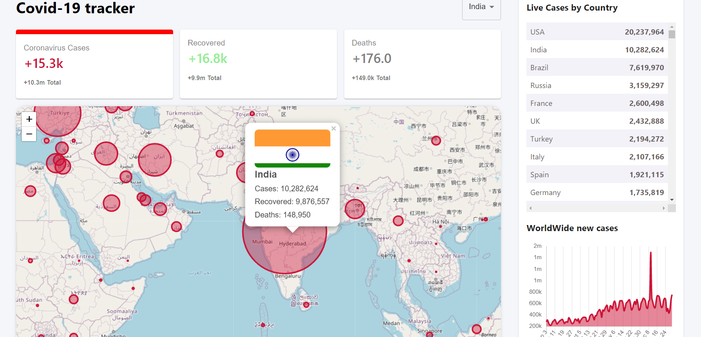

# Covid-19 Tracker App

This Project is a beginner friendly project I built using React. Some key Aspects:

- Developed a website which displays daily Covid
  cases,recovered and deaths as well as total
  cases,recovered and deaths till date.User can
  select country using world map or drop-down
  menu and data of selected country is
  displayed.
- Data of the selected country of past 4 months
  is displayed on the graph.
- Live cases by country are displayed in
  descending order of daily Covid cases.
- Clickable Markers on Map show Country stats till date.

